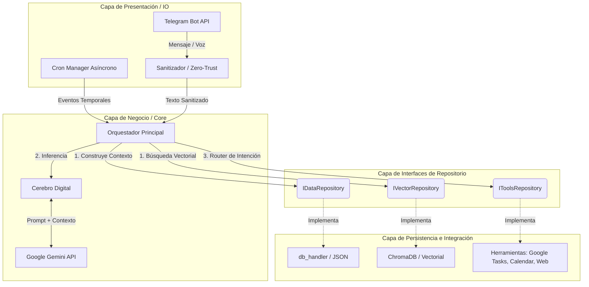
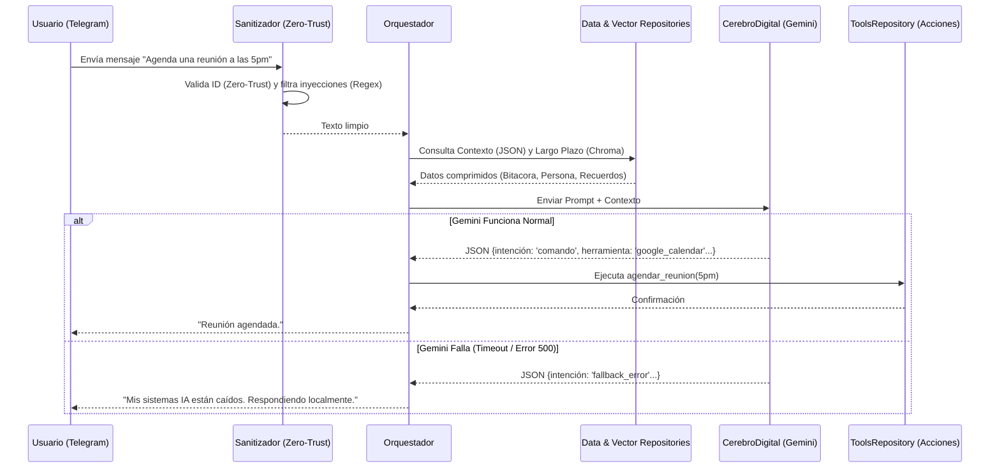

# Arquitectura de JARVIS V2

Este documento describe la arquitectura técnica, los flujos de datos y los principios de diseño que rigen **JARVIS V2**. El sistema está diseñado siguiendo prácticas **SOLID, Zero-Trust, Graceful Degradation y Low-Coupling**.

---

## 1. Diagrama de Componentes (Mermaid)

---

## 2. Diagrama de Flujo del Mensaje (Secuencia)

---

## 3. Principios de Diseño Aplicados

1. **Inversión de Dependencias (DIP):** El `Orquestador` no interactúa directamente con `db_handler` ni `ChromaDB`. Lo hace a través de `IDataRepository` e `IVectorRepository`, lo que permite un `Mocking` eficiente en las pruebas unitarias.
2. **Concurrencia Segura y Atomicidad:** Se reemplazó el antiguo uso de `threading` por un Cron Manager asíncrono puro que se adhiere al Event Loop de Telegram, y se utilizan candados `asyncio.Lock` en `db_handler` para operaciones IO de tipo todo-o-nada.
3. **Idempotencia:** Tareas como agendar en Google Calendar o registrar eventos diarios en el CRON verifican primero el estado previo, impidiendo datos duplicados si se reinicia el contenedor (ej. en caídas del VPS de DigitalOcean).
4. **Data Masking (ISO 27001):** La clase `Sanitizador` enmascara información crítica del usuario (como tarjetas, emails, teléfonos) antes de que estos ingresen al archivo rotativo del sistema de logs `jarvis_v2.log`, asegurando confidencialidad a largo plazo.
5. **Optimización Big-O:** `ChromaDB` delega el cálculo pesado de Embeddings a la API de Gemini, ahorrando ~80MB de RAM, crucial para la limitación de memoria del VPS (1GB). Así mismo, las lecturas JSON utilizan filtrado previo para no subir a memoria todo el histórico.
